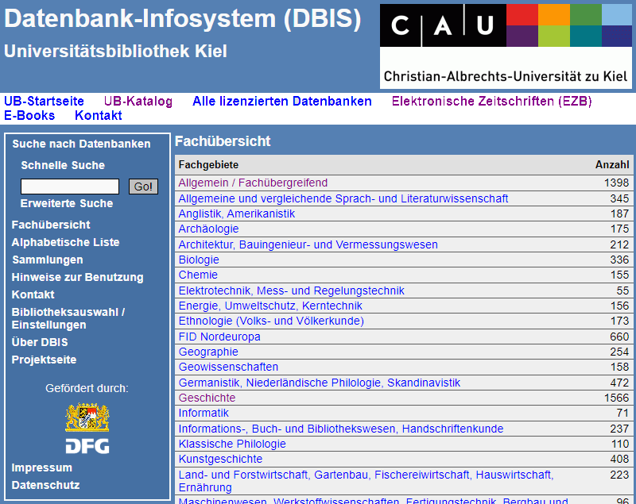

<!--
author:   Jessika Stiefken

email:    stu120720@mail.uni-kiel.de

version:  0.0.1

language: de

narrator: Deutsch Female

comment:  Try to write a short comment about
          your course, multiline is also okay.

link:     https://cdn.jsdelivr.net/chartist.js/latest/chartist.min.css

script:   https://cdn.jsdelivr.net/chartist.js/latest/chartist.min.js

-->

# Die digitale Literaturrecherche

<section>

Literaturrecherche und die Arbeit mit Literatur sind feste Bestandteile des Studiums. Doch wo fängt man überhaupt an, Literatur zu suchen? Welche Datenbanken könnten dabei helfen und wie werden sie möglichst effektiv genutzt? 
Mit den richtigen Basics ist die Literaturrecherche gar nicht so schwer!

In diesem Baustein stellen wir dir einige nützliche Strategien und Tools für die Literatursuche vor. Der Kurs ist in folgende sechs Kapitel gegliedert:

 

* [Vom Thema zum Suchbegriff](#2)

* [Bibliografien und Literaturdatenbanken](#3)

* [Die richtige Suchstrategie](#4)

* [Modifizierung der Suche](#5)

* [kleiner Selbsttest](#6)

* [Weiterführende Links](#7)

 Du kannst alle sechs Kapitel in der vorgegebenen Reihenfolge abschließen. Du kannst aber auch bereits bekannte Inhalte überspringen oder gezielt einzelne Kapitel ansteuern. 
 
 

 Wir wünschen dir viel Spaß!

</section>

## Vom Thema zum Suchbegriff

        {{0-1}}
<section>

Eine Literaturrecherche beginnt am besten mit einem leeren Blatt Papier. Denn zuallererst musst du herausfinden, wonach du überhaupt suchen musst. Auch wenn du schon ein grobes Thema für deine Recherche hast, gilt es nun erst einmal, das Thema genauer zu beschreiben und in mögliche Teilaspekte zu teilen. Auf diese Weise erhältst du geeignete Suchbegriffe, mit denen du dich dann auf die Suche nach passender Literatur begeben kannst.

>➪ Versuche zu Beginn deiner Recherche dein Thema und deine Fragestellung durch **zentrale Schlüsselbegriffe** genauer zu definieren. Diese sind hilfreich und auch notwendig für eine gelungene Recherche in einer Online-Datenbank.

</section>

        {{1-2}}
<section>

<h3> Auf der Suche nach Kernbegriffen </h3>

Eine schnelle und übersichtliche Möglichkeit, an geeignete Suchbegriffe zu kommen, ist die Verwendung von **"Wortlisten"**. Überlege dir die wichtigsten Kernbegriffe zu deinem Thema und schreibe sie in eine Tabelle. Hier kann es sich auch anbieten, im Vorfeld eine kleine Mindmap zu machen, um erst einmal wichtige Begriffe und Aspekte zu sammeln. 

Fülle im Anschluss die Tabelle mit weiteren Ober- und Unterbegriffen, Synonymen, Übersetzungen und verwandten Begriffen. Auf diese Weise kannst du dein Thema weiter präzisieren und die Suche optimieren.

>➪ Auf der nächsten Seite findest du ein Beispiel für eine ausgefüllte Wortliste.

**Hier kannst du dir eine leere Wortliste herunterladen:**

- [als .docx-Datei](/Download-Dateien/Wortliste.docx)

- [als .pdf-Datei](/Download-Dateien//Wortliste.pdf)

</section>

        {{2-3}}
<section>

<h3> Die Verwendung von Wortlisten </h3>

Hier wurde vor Beginn der Recherche eine fiktive Wortliste für eine Hausarbeit geschrieben, die sich inhaltlich mit der Bedeutung von Zeitzeugen in Gedenkstätten zur NS-Geschichte auseinandersetzen soll. 

>➪ Zu Beginn kannst du vielleicht nicht jede Zeile der Tabelle ausfüllen. Das ist überhaupt nicht schlimm, sondern ein guter **Anknüpfungspunkt für deine Literaturrecherche**: Wo musst du deine Suche vielleicht noch ein wenig verfeinern? Wo verlierst du vielleicht das "Große Ganze" aus den Augen?

</section>

        {{3-4}}
<section>

<h3> Die Weiterentwicklung von Wortlisten </h3>

So sah die Wortliste nach einiger Recherche aus. Einzelne Begriffe haben im Verlauf der Suche **ins Leere geführt** andere sind im Laufe der Recherche dazu gekommen. Manche Begriffe führen zu interessanten Aspekten der Kernthemen, die jedoch für die Zielsetzung der Hausarbeit **nicht gewinnbringend**  sind. Daher wurden sie ebenfalls gestrichen, um die Suche zu verschlanken.

Zusätzlich ist ein ganzer **Kernbegriff** neu dazu gekommen. Dieser hat sich im Laufe der Recherche als vielversprechend herauskristallisiert, sodass er als weiterer Themenaspekt in die Liste aufgenommen wurde. Auf diese Weise kann sich eine Wortliste sehr **dynamisch** mit der Literatursuche entwickeln und sie inhaltlich **nachvollziehbar** machen.

>➪ **Wortlisten** helfen dir, die Übersicht zu behalten und deine Suche zu strukturieren, indem sie Schlüsselbegriffe festhalten. Eine gut geführte Wortliste kann auch mögliche **inhaltliche Schwerpunkte** für die Strukturierung deiner Arbeit aufzeigen.

</section>

        {{4-5}}
<section>

<h3> Probiere es einmal selbst aus! </h3>

✎ Erstelle einmal eine Wortliste zu einem deiner Themen. Suche dafür mindestens drei zentrale Kernbegriffe aus und fülle die Tabelle für einen der Begriffe aus. 
Du kannst dafür die leeren Vorlagen ([als .docx](/media/Wortliste.docx)/[als .pdf](/media/Wortliste.pdf)) verwenden oder sie einfach auf ein leeres Blatt Papier bzw. ein digitales Pendant schreiben. 
 
 
Du wirst die Liste später noch einmal brauchen, also lege sie nicht zu weit weg.

 

**Tipps für die Wortliste**

* Liste nur aussagekräftige Begriffe auf. Welche Kernbegriffe sind für dein Thema wichtig?
* Bedenke andere bzw. frühere Schreibweisen.
* Löse Abkürzungen auf.
* Singular- und Pluralformen können durch Trunkierung (*) einbezogen werden.
* Übersetze die Suchbegriffe, wenn du fremdsprachige Rechercheinstrumente verwendest.
* Überlege, ob die Verbindung mehrerer Begriffe zu einem Kompositum oder die Zerlegung von Komposita zu mehreren Suchbegriffen sinnvoll sein kann.
* Verwende Fach-Thesauri oder Wörterbücher als Orientierung.
* Ergänze die Wortliste im Verlauf der Recherche.

>➪ Wortlisten sind ein wenig wie Mindmaps: Es gibt nicht die EINE richtige Lösung, sondern jede Liste ist eine persönliche Gedankenstütze für deine eigene Hausarbeit. Hier geht es nicht darum, möglichst viel in die Zeilen zu schreiben, sondern die **eigene Suche möglichst effektiv zu steuern.**

</section>

## Bibliografien und Literaturdatenbanken

        {{0-1}}
<section>

Nachdem du dir eine Übersicht gemacht hast, WAS du suchen willst, folgt nun die Frage, WO man überhaupt sucht. Für eine erfolgreiche Onlinerecherche ist die Auswahl einer geeigneten Datenbank sehr wichtig. Im Folgenden sollst du erfahren, wie und wo du geeignete Datenbanken finden kannst. 

Zur besseren Übersicht grenzen wir einmal drei unterschiedliche **Suchräume** grob ab:

* Kataloge der Universitätsbibliothek
* Fachdatenbanken
* Internetrecherche

>➪ Wichtig ist, dass du dich nicht auf einen einzelnen Suchraum verlässt! Jeder Suchraum hat seine eigenen Vor- und Nachteile und nur durch **mehrere Suchorte** kannst du dein Thema gründlich bearbeiten.

</section>

        {{1-2}}
<section>

<h3> Kataloge der Universitätsbibliothek</h3>

Die Universitätsbibliothek verfügt über zwei unterschiedliche Katalogsysteme, die beide auf den gleichen Bestand zugreifen. Sie geben Auskunft über die bibliografischen Angaben, den Standort und die Entleihbarkeiten von Literaturtiteln. Dabei durchsuchen sie den gesamten Buchbestand der Zentralbibliothek und der Fachbibliotheken.

|  |  | 
| ---- |:----------- |
|[Der "klassische" Katalog (OPAC)](https://katalog.ub.uni-kiel.de/)  |[Der neuere Discovery-Service](https://discovery.ub.uni-kiel.de)  |

Beide Kataloge bieten viele Möglichkeiten, die Suche einzuschränken und zu spezifizieren. Zusätzlich bieten sie bei elektronischen Medien einen direkten campusweiten Zugang. Dennoch gibt es einige kleine Unterschiede zwischen den beiden Katalogsystemen, sodass es sich durchaus lohnen kann, zwischen den beiden Katalogen abzuwägen bzw. beide Kataloge parallel zu verwenden. Auf der nächsten Seite kannst du diese Unterschiede einmal erkunden.

>➪ Eine Literatursuche über den Katalog bringt schnelle Erfolge und verweist auf konkret vor Ort oder digital verfügbare Literatur. Sie begrenzt den Suchbereich jedoch nur auf den **Bestand der Universitätsbibliothek und der Fachbibliotheken**, nicht auf die allgemein verfügbare Literatur.

</section>

        {{2-3}}
<section>

<h3>Was bieten die Kataloge?</h3>

Beide Kataloge der Universitätsbibliothek bieten einen schnellen Überblick über die vor Ort oder digital verfügbare Literatur und deren Verfügbarkeiten. Dennoch unterschieden sie sich nicht nur optisch voneinander. 

[Link zum UB-Katalog](https://katalog.ub.uni-kiel.de/)

[Link zum Discovery-Service](https://discovery.ub.uni-kiel.de)

✎ Öffne einmal beide Kataloge in deinem Browser, suche nach einem Buch von deiner Literaturliste und bearbeite nun das **Quiz** unten. 
 
Wenn dir kein Buch einfällt, dann such doch einfach:
 
*Assmann, Aleida: Erinnerungsräume. Formen und Wandlungen des kulturellen Gedächtnisses, München 2009*. 

[[OPAC ] [Discovery-Service ]]
[   [X]        [ ]          ] Allgemeine und gezielte Suchmöglichkeiten (z.B. Personen, Zeitschriftenreihen)
[   [ ]        [X]          ] Hervorhebung  des gesuchten Begriffes
[   [X]        [ ]          ] Zeigt standardmäßig die neusten Eintragungen zuerst an
[   [ ]        [X]          ] Zeigt standardmäßig die relevantesten Eintragungen zuerst an
[   [X]        [X]          ] Grafische Darstellung des Medientyps und Formats
[   [ ]        [X]          ] Einstellbare Zeitleiste zur Eingrenzung der Veröffentlichungsjahre
[   [X]        [ ]          ] Bietet Möglichkeiten zu Signatursuche
[   [X]        [ ]          ] Funktioniert in mehreren Tabs
[   [X]        [X]          ] Listet passende Schlagworte zum gewählten Buch auf
[   [X]        [ ]          ] Chronologische Suchgeschichte

</section>

        {{3-4}}
<section>

<h3>Fachdatenbanken</h3>

Fachdatenbanken listen neben Monographien und Sammelwerken hauptsächlich **einzelne Artikel** aus wissenschaftlichen Zeitschriften und Sammelwerken aus einem bestimmten Fachbereich auf. Diese sind häufig aktueller, da Schreib- und Publikationsprozess dieser Beiträge wesentlich kürzer dauert als bei Büchern. Zusätzlich können sie auch **sehr spezialisierte Aspekte** einzelner Forschungsfelder behandeln, die für deine Arbeit möglicherweise interessant sind.

✎ Kennst du bereits Fachdatenbanken, die für deinen Fachbereich interessant sind? 

Kennst du allgemeine wissenschaftliche Datenbanken? 

</section>

        {{4-5}}
<section>

Eine gute **Übersicht** bietet dir das Datenbank-Infosystem (DBIS) der Universitätsbibliothek Kiel. Dort ist eine Vielzahl verschiedener Datenbanken nach Fachbereichen sortiert aufgelistet. Diese sind entweder frei zugänglich oder von der Universitätsbibliothek Kiel lizensiert.

[Link zum Datenbank-Infosystem (DBIS)](http://rzblx10.uni-regensburg.de/dbinfo/fachliste.php?bib_id=ubk&lett=l&colors=&ocolors=)

✎ Suche doch einmal auf der Seite des DBIS nach deinem Fachbereich und klicke auf ihn. 
Welche Fachdatenbanken werden dir vorgeschlagen? Was für Spezialisierungen haben sie? 

</section>

        {{5-6}}
<section>

<h3>Internetrecherche</h3>

Allgemeine Suchmaschinen wie Google eignen sich häufig für einen **schnellen Überblick** über ein bestimmtes Thema. Für eine tiefere Recherche eignen sie sich jedoch aus einigen Gründen in der Regel nicht.

Dazu gehört neben den Problemen der Relevanzbewertung durch die Suchmaschine selbst und das Fehlen von systematischen Qualitätskriterien auch das Problem der Zugänglichkeit: Wissenschaftliche Literatur findet sich häufig in lizensierten Datenbanken und geschlossenen Bibliothekssystemen. Diese Daten befinden sich im sogenannten **"Deep Web"** und sind daher für Suchmaschinen nicht zu finden.

>➪Allgemeine Suchmaschinen und eine breitere Internetrecherche können besonders für den Anfang auf der Suche nach einem schnellen ersten Überblick sehr hilfreich sein. **Eine vertiefte Literaturrecherche ist jedoch nicht möglich.**

</section>

        {{6-7}}
<section>

<h3>Auch mal nach Hilfe fragen</h3>

Bei der Vielzahl an Datenbanken, die es für die verschiedenen Fachbereiche gibt, ist es natürlich, dass man sich gerade am Anfang überfordert fühlt. Ihr könnt auch eure Dozenten, bei denen ihr die Hausarbeit schreibt, nach geeigneten Datenbanken für die Recherche für euer Thema fragen. 

>➪Auch bei der Online-Recherche gilt: es ist noch kein Meister vom Himmel gefallen. Und Datenbank ist nicht gleich Datenbank.

</section>

## Die richtige Suchstrategie

        {{0-1}}
<section>

Auch wenn es verlockend ist, solltest du es vermeiden nach ganzen Sätzen oder Fragestellungen zu suchen. Oftmals sind die Ergebnisse, die aus einer solchen Suche resultieren ungenau und zu umfangreich. Diese erst zu sichten und zu sortieren, kostet dich viel Zeit.

Hier kommt deine **Wortliste** vom ersten Kapitel wieder zum Tragen: Sie hilft dir bei der Suche nach Schlüsselbegriffen und als Orientierung im Suchprozess. Auch die Verwendung von **Literaturverwaltungsprogrammen**[^1](https://www.ub.uni-kiel.de/de/beratung-kurse/literaturverwaltung) wie Citavi oder EndNote helfen dir, den Überblick über die gelesenen Quellen zu bewahren.

>➪ Versuche zu Beginn deiner Recherche dein Thema und deine Fragestellung durch **zentrale Schlüsselbegriffe** genauer zu definieren. Diese sind hilfreich und auch notwendig für eine gelungene Recherche in einer Online-Datenbank.

</section>

        {{1-2}}
<section>

<h3>Grundlegendes zur Eingabe von Suchbegriffen</h3>

Die richtige Verwendung von Suchbegriffen ist nicht immer so einfach wie bei Google, zumal die Plattformen in der Regel nicht über eine Rechtschreibkorrektur verfügen. Dennoch sind sie elementar wichtig, um deine Anfrage für die jeweilige Datenbank verständlich zu machen. 
Mit ein wenig Übung fällt es dir aber schnell leicht! 
 
 
Hier ein paar Hinweise zur "richtigen" Eingabe:

* **Groß- und Kleinschreibung** muss in der Regel nicht beachtet werden.
* Bei **Sonderzeichen**, wie beispielsweise Akzenten, kannst du die Grundform des Buchstabens verwenden (e statt é).
* Löse **Umlaute** und das ß auf (ae statt ä, oe statt ö, ue statt ü, ss statt ß).
* **Übersetze** Suchbegriffe, wenn du fremdsprachige Recherchetools verwendest.
* Wörter mit **Bindestrich** können in den meisten Datenbanken als ein Wort oder als zwei Wörter interpretiert werden.

</section>

        {{2-3}}
<section>

<h3>Die richtige Suche nach Personen, Titeln und Themen</h3>

* Bei der **Autor:innensuche** solltest du dieses Format verwenden: *Nachname, Vorname*. Wirst du so nicht fündig, beschränke dich auf den Nachnamen. Manchmal sind Vornamen nur in abgekürzter Form aufgeführt oder gar nicht vorhanden.
* Gib bei der Suche nach einem **Titel** maximal 2-3 Stichwörter ein. Das ist ausreichend, um die Treffermenge einzugrenzen. Zudem verringerst du dadurch das Risiko den gesuchten Titel aufgrund eines Tippfehlers oder wegen einer abweichenden Schreibweise zu übersehen.
* Bei der Suche nach einem **Thema** solltest du Suchfelder wie „Freitext“, „Schlagwort“ oder „Basic Index“ verwenden. Hierbei können die Bezeichnungen je nach Suchdienst abweichen.

 ✎ Beantworte mithilfe des [OPAC](https://katalog.ub.uni-kiel.de/) folgende Fragen:

1. Aus welchem Jahr ist das älteste Buch von Albert Einstein, das im OPAC zu finden ist?

    [[1905]]
    [[?]] *Sieh dir einmal die Suchfilter über dem Eingabefeld an. Gibt es dort vielleicht einen schnellen Weg, nur einen bestimmten Autor anzeigen zu lassen?*

2. Dein Dozent empfiehlt dir für deine Hausarbeit einen bestimmten Aufsatz aus dem Buch *""Wollten Sie auch immer schon einmal pestverseuchte Kühe auf ihre Gegner werfen?": eine fachwissenschaftliche Annährung an Geschichte im Computerspiel"*. Suche das Buch mithilfe von unterschiedlichen Stichworten. Unter welcher Signatur steht das Buch in der Universitätsbibliothek?

    [[Bp 2115]]

3. Welche Schlagwörter findest du unter dem Eintrag des Buches?

    [[X]] Computerspiel
    [[ ]] Freizeit
    [[ ]] Geschichte
    [[X]] Geschichtsdarstellung
    [[X]] Geschichtswissenschaft

4. Klicke einmal auf die unterschiedlichen Schlagwörter und sieh dir die Ergebnisse an: Was für eine Funktion erfüllen die verlinkten Schlagwörter? 

    [[Sie sind Stichwörter aus dem Titel des jeweiligen Werks und erleichtern die Suche nach dem Eintrag.
    |  (Sie sind normierte Vokabeln und beschreiben den Inhalt des jeweiligen Werks unabhängig vom Titel. Auf diese Weise erleichtern sie die Suche nach ähnlichen Werken.)
    ]]
    

</section>

## Modifizierung der Suche

        {{0-1}}
<section>

  

 

Deine Literatursuche wirft viel zu viele oder fast gar keine Ergebnisse ab? Keine Panik - in den meisten Fällen muss man einfach ein wenig Herumprobieren und mehrere Suchdurchläufe starten, um ein zufriedenstellendes Ergebnis zu bekommen. 

Hier findest du noch ein paar nützliche Opteratoren, die dir helfen, deine eigene Suche mit wenigen Handgriffen zu erweitern oder weiter zu verkleinern. Auf diese Weise kannst du deine Suchergebnisse entsprechend steuern

>➪ Beobachte die Suchergebnisse deiner Suche und passe deine Sucheingaben entsprechend an, um noch effektiver Suchen zu können.

</section>

        {{1-2}}
<section>

<h3>Die Verwendung von Platzhaltern (Trunkierung)</h3>

Wenn dir die Schreibweise eines Begriffs nicht klar ist oder du einen Begriff gleichzeitig in verschiedenen Schreibweisen / Formen / Sprachen finden möchtest, verwendest du Platzhalter. Das Sternchen (*) ersetzt i.d.R. beliebig viele Zeichen, das Fragezeichen (?) genau ein Zeichen.

* Du suchst nach: Bibliothek* ⟶ Du findest Treffer mit den Worten: Bibliothek, Bibliotheken, Bibliothekare usw.	
* Du suchst nach: tele*on ⟶ Du findest Treffer mit den Worten: Telefon, Telephon (aber auch: Television, Telekommunikation usw.)
* Du suchst nach: do?umentation ⟶ Du findest Treffer mit den Worten: documentation und Dokumentation

 

 ✎ Suche ein Stichwort aus deiner Wortliste aus und suche es im [OPAC](https://katalog.ub.uni-kiel.de/)! Wie verändert sich die Trefferanzahl, wenn du Bestandteile des Wortes mit * trunkierst? Wie verändert sich die Trefferanzahl, wenn du stattdessen ein ? verwendest? Welche Kombination ergab die besten Treffer für diese Suche?

Wenn ich das * verwende...

[[ werden die Ergebnisse **weniger**. 
| ( werden die Ergebnisse **mehr**. ) 
| bleiben die Ergebnisse **gleich**. ]]

Wenn ich statt dem * das ? verwende...

    [[  (werden die Ergebnisse **weniger**.)
    | werden die Ergebnisse **mehr**.
    | bleiben die Ergebnisse **gleich**. ]]

Für **diese konkrete** Suche war diese Kombination am besten: 

    [[___]]

 

 **Achtung**: In manchen Suchdiensten können Platzhaltern überhaupt nicht oder nur am Ende eines Wortes verwendet werden oder es kann nur das Sternchen verwendet werden und nicht das Fragezeichen. Am Anfang eines Wortes kannst du Platzhalter in aller Regel nicht verwenden.

</section>

        {{2-3}}
<section>

<h3>Suchbegriffe kombinieren</h3>

Es gibt verschiedene Möglichkeiten, um mehrere Suchbegriffe innerhalb eines Suchfelds oder Begriffe in verschiedenen Suchfeldern miteinander zu kombinieren. In vielen Datenbanken gibt es folgende Kombinationsmöglichkeiten:

 

**Alle Begriffe finden (UND)**

Verwende das Wort AND (in Großbuchstaben), das Pluszeichen oder einfach das Leerzeichen, um Treffer zu erhalten, in denen alle Suchbegriffe vorkommen.

* digital AND literacy
* digital +literacy
* digital literacy

> ➪ Bei Verwendung des Leerzeichens werden zum Teil zuerst die Treffer angezeigt, in denen alle Suchbegriffe vorkommen und dann die, in denen nur einige oder nur einer der eingegebenen Suchbegriffe vorkommt. 

**Einen oder mehrere Begriffe finden (ODER)**

Verwende das Wort OR (in Großbuchstaben) oder die Klammern ( ), um Treffer entweder mit dem einen oder dem anderen (oder beiden Suchbegriffen) zu erhalten.

* star OR stern
* (star stern)

>➪ Eine ODER-Verknüpfung erweitert den Suchbereich stark. Das führt häufig zu sehr vielen Treffern.

**Phrasen finden (" ")**

Verwende Anführungsstrichen, um Wörter als zusammenhängenden Ausdruck (Phrase) zu suchen.

* "Allgemeine Relativitätstheorie"
* "Bunte Kühe am Strand"

>➪ Die Phrasensuche setzt die Suchbegriffe im Unterschied zur UND-Suche auf eine bestimmte Reihenfolge der Suchbegriffe fest.

 ✎ Aufgabe: Versuche einmal, mehrere Begriffe von deiner Wortliste auf unterschiedliche Weise miteinander zu kombinieren und beobachte dabei die Ergebnisse. Was verändert sich? Welche Kombinationsmöglichkeiten machen Sinn, welche weniger?

[Prüfen](/media/Kombinationen.png)

</section>

        {{3-4}}
<section>

<h3>Begriffe aus der Suche ausschließen</h3>

Verwende das Wort NOT (in Großbuchstaben) oder das Minuszeichen, um Treffer zu erhalten, die zwar den ersten Suchbegriff beinhalten, jedoch nicht den zweiten.

* digital NOT literacy
* digital -literacy

>➪ Die NOT-Suche verkleinert den Suchbereich, indem sie nur die Begriffe vor dem NOT sucht und den hinter dem NOT ausschließt.

 ✎ An welcher Stelle könnte die Verwendung von NOT bei einer Suche hilfreich sein?

- [[ ]] Wenn ich von Anfang an bestimmte Kombinationen aus meiner Suche ausschließen möchte (z.B. Eisbären NOT Zoo). 
- [[X]] Wenn ich bestimmte Faktoren, die in meiner Suche häufig zu Fehltreffern führen, aus der Suche ausschließen möchte (z.B. Apfelkuchenrezept NOT Backpulver).
- [[x]] Wenn ich mehrere Begriffe miteinander verbinden, aber einen bestimmten Begriff ausschließen möchte.

 

**Achtung**: Einige Suchmaschinen erkennen das Wort NOT nicht in seiner Funktion und suchen stattdessen nach dem deutschen Wort "Not".

</section>

## Alles verstanden? - Teste dich jetzt!

<h3>Richtig oder falsch?</h3>

[[_richtig_] [_falsch_]]
[[X] [ ]] Ich sollte auf der Suche nach Suchbegriffen für meine Recherche möglichst aussagekräftige Begriffe verwenden und unnötige Füllwörter vermeiden. 
[[ ] [X]] Sonderzeichen und Umlaute müssen unbedingt richtig geschrieben werden, damit auch der richtige Begriff gefunden werden kann.
[[X] [ ]] Bei der Suche nach einem Thema sollte als Suchfeld entweder "Freitext", "Schlagwort" oder "Basic Index" verwendet werden.
[[X] [ ]] Wenn ich nach besonders neuen oder speziellen Themen suche, sollte ich eine Fachdatenbank verwenden.
[[X] [ ]] Bei einer ODER-Verknüpfung wird der Suchbereich stark erweitert. Es kommt daher zu sehr vielen Treffern.
[[ ] [X]] Es ist nicht möglich gleichzeitig nach verschiedenen Schreibweisen eines Begriffs zu suchen. Sowas muss manuell und einzeln nacheinander eingegeben werden.
[[ ] [X]] Jede Suchmaschine funktioniert gleich.
[[X] [ ]] Ich sollte bei der Literatursuche immer ein wenig mit den Parametern und Schlagworten spielen, wenn die Schlüsselbegriffe nicht zu einem guten Ergebnis führen.
[[ ] [X]] Der Katalog der Universität zu Kiel ist für eine umfangreiche Literaturrecherche vollkommen ausreichend.  
[[X] [ ]] Ich kann die Anzahl der Suchergebnisse mithilfe von verschiedenen Modifikationen und Einstellmöglichkeiten variieren.

## Weiterführende Links

Die Tipps und Tricks, die du eben erhalten hast, bilden das Basiswissen, das du für eine erfolgreiche Online-Recherche benötigst. Wenn du dein Wissen in diesem Bereich weiter ausbauen möchtest, können dir diese Links helfen:

* [E-Learning-Angebote zum wissenschaftlichen Arbeiten der CAU](https://www.ub.uni-kiel.de/de/beratung-kurse/e-learning-angebote/linkliste)
* [Tipps für die Recherche - Universität Bielefeld](https://www.uni-bielefeld.de/ub/search/help/)
* [Tipps für die Recherche im Internet](https://studieren.de/recherchieren-internet.0.html)
* [Kann man das googlen? - 10 Tipps für eine gelungene Internetrecherche](https://magazin.sofatutor.com/schueler/kann-man-das-googlen-10-tipps-fuer-eine-gelungene-internetrecherche/)